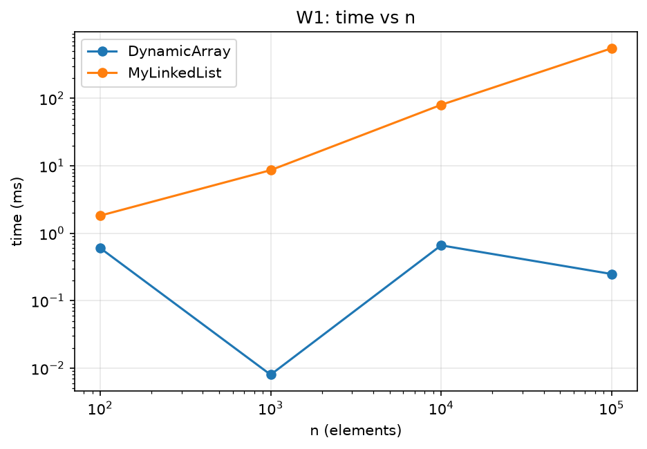

# Assignment 2 — Data Structures

## 1. Complexity Table
| Structure | Operation | Best | Average | Worst | Aux. space | Justification |
|---|---|---|---|---|---|---|
| DynamicArray | add(x) | Θ(1) | Θ(1) amortized | O(n) | O(1) | resize copies n items, but doubling amortizes to O(1) |
| DynamicArray | add(i,x) | Θ(1) (i=size) | Θ(n) | Θ(n) | O(1) | shifts size−i elements |
| DynamicArray | remove(i) | Θ(1) (last) | Θ(n) | Θ(n) | O(1) | shifts size−i−1 elements |
| DynamicArray | get(i) | Θ(1) | Θ(1) | Θ(1) | O(1) | direct indexing |
| DynamicArray | contains(x) | Θ(1) | Θ(n) | Θ(n) | O(1) | linear scan, early exit if found first |
| MyLinkedList | add(x) | Θ(1) | Θ(1) | Θ(1) | O(1) | tail pointer |
| MyLinkedList | add(i,x) | Θ(1) (i=0) | Θ(n) | Θ(n) | O(1) | walk to node i−1 |
| MyLinkedList | remove(i) | Θ(1) (i=0) | Θ(n) | Θ(n) | O(1) | walk to node i−1 |
| MyLinkedList | get(i) | Θ(1) (i=0) | Θ(n) | Θ(n) | O(1) | i pointer hops |
| MyLinkedList | contains(x) | Θ(1) | Θ(n) | Θ(n) | O(1) | linear scan |
| MinHeap | insert(x) | Θ(1) | O(log n) | Θ(log n) | O(1) (amortized resize) | bubble-up; random data ≈ O(1) on average |
| MinHeap | peekMin() | Θ(1) | Θ(1) | Θ(1) | O(1) | root read |
| MinHeap | extractMin() | Θ(1) (size 1) | Θ(log n) | Θ(log n) | O(1) | bubble-down along height |

Total space of every structure: Θ(n) (list: with extra node overhead).

## 2. Loop Invariant Proofs

### 2.1 DynamicArray.contains(x)
```java
for (int i = 0; i < size; i++) if (data[i] == x) return true;
return false;
```
**Invariant:** before each iteration with index i, x does not occur in data[0..i-1].
**Initialization:** i = 0, the range data[0..-1] is empty, so x is not in it.
**Maintenance:** if the invariant holds before iteration i and data[i] != x, then x is not in data[0..i], which is the invariant for i+1. If data[i] == x, we return true and never reach the next iteration.
**Termination:** the loop ends with i = size, so x is not in data[0..size-1], i.e. not in the whole array.
**Conclusion:** `true` is returned only when x was found, and `false` only after the invariant proved x is absent, so contains is correct.

### 2.2 MinHeap.bubbleUp(i)
**Invariant:** before each iteration, the heap property a[parent] <= a[child] holds for all pairs except possibly (a[i], a[parent(i)]); additionally a[parent(i)] <= both children of i (when i has them).
**Initialization:** the new element is placed at index size; the rest of the array was a valid heap, so the only possible violation is at the new element and its parent.
**Maintenance:** if a[i] < a[p], we swap. The smaller value moves to p, so the pair (p, i) is now correct. The old parent value is now at i and is <= its other child, because it was the ancestor of that subtree. The only possible violation moves to (p, parent(p)), which is the invariant for i = p.
**Termination:** the loop stops when i = 0 (no parent) or a[i] >= a[parent]; in both cases the one allowed exception does not exist.
**Conclusion:** after bubbleUp the whole array satisfies the heap property, so insert keeps MinHeap correct.

## 3. Plots
(вставьте:  ... барлық 8 сурет)

## 4. Discussion
DynamicArray stores int values contiguously, so one 64-byte cache line holds 16 elements and a single memory fetch serves 16 consecutive reads. This spatial locality, together with the hardware prefetcher, makes iteration and contains very fast. get(i) is one address calculation, so it costs exactly 1 step, while MyLinkedList needs about i pointer hops (W1 steps confirm this). Even when both structures perform the same number of steps, as in W2 where both scan n elements, the list is slower. Each node is a separate heap object with a header (12–16 bytes), an int and a reference, so a node takes about 24 bytes versus 4 bytes per array element. Reading the next node depends on the previous load (pointer chasing), so the CPU cannot overlap memory accesses and often waits for cache misses. Nodes are spread across the heap, which defeats prefetching and wastes cache lines. Many small objects also put pressure on the garbage collector, which has to trace and move them. In W3-head the list wins: insertion at index 0 is O(1) with only two pointer updates, whereas the array shifts n elements each time. In W3-middle the list must walk n/2 nodes, so the array's fast contiguous memmove-like shifting often wins despite the same O(n). MyLinkedList is a better choice for frequent insertions/removals at the head with no random access. MinHeap is the right choice for priority scheduling: insert and extractMin are O(log n) and peekMin is O(1), compared with O(n) for finding the minimum in an array or list.